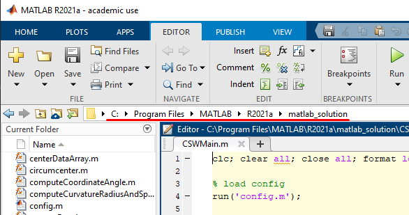

# curve-speed-warning-system
### MATLAB & Simulink implementation of Curve Speed Warning System. 
System warns driver when current speed of the vehicle exceeds recommended speed. Recommended speed is based on input data calculation (latitude, longitude, speed, time). Input data are processed by computation logic, which predicts future trajectory of vehicle, from which the recommended speed is obtained.

Curve Speed Warning System consists of online and offline version of solution for Simulink and online version of solution for MATLAB. Online version of solution uses real-time data as input to simulation. Offline version uses data saved in file for retrospective evaluation of the simulation.

Repository contains 5 folders:
- assets - Images used in README.md
- csws - Library for MATLAB Simulink
- matlab_solution - Script implemented in MATLAB
- scripts - Python script to parse NMEA / TXT file containing NMEA-0183 data
- examples - Example Simulink models for both offline and online data

List of contents:
Installation
- [Installation guide](#Installation-guide)
- [Installation verification](#Installation-verification)
- [Addons installation](#Addons-installation)
- [MATLAB script installation](#MATLAB-script-installation)
- [NMEADataParser script installation](#NMEADataParser-script-installation)

User guide
- [Online version user guide](#Online-version-user-guide)
- [Offline version user guide](#Offline-version-user-guide)
- [NMEADataParser script user guide](#NMEADataParser-script-user-guide)

Configuration
- [Simulink configuration](#Simulink-configuration)
- [MATLAB script configuration](#MATLAB-script-configuration)

## Installation guide
Installation Guide describes individual steps to install solution of the curve speed warning system.
1. Install MATLAB. Follow the instructions on page https://uk.mathworks.com/help/install/. MATLAB is available on the MathWorks website https://www.mathworks.com/downloads/. Recommended version is at least 2021a, on which the solution was developed. Older versions may not be compatible.
2. During the installation, in the Products section select following products to install:
   - MATLAB
   - Simulink
   - Automated Driving Toolbox
   - DSP System Toolbox
   - Navigation Toolbox
   - Vision HDL Toolbox
   
3. Download and extract curve-speed-warning-system repository.
4. Place the csws folder in the folder with installed MATLAB application, typically in the path C:\Program Files\MATLAB\R2021a.
5. Run the MATLAB as an administrator.
6. In the ENVIRONMENT section of the HOME section, click Set Path.
   
7. Set Path window is shown.
8. Select Add Folder and set path to csws folder, typically in the path C:\Program Files\MATLAB\R2021a\csws.
   
9. Select Save and then Close.

### Installation verification
To verify the correctness of the installation, perform the following steps:
1. Launch MATLAB.
2. In the HOME section click on the Simulink button, which invokes launching Simulink.
3. Simulink Start Page window is shown. In the Simulink tab, select Blank Model.
   
4. Wait for Simulink model to open, then click on the Library Browser in the SIMULATION section.
   
6. Library Browser window opens. Verify that Curve Speed Warning System Toolbox is among the available libraries.
   
   
### Addons installation
For the correct functioning of the online version of the solution, it is necessary to install these 3 software addons:
- Minimal ADB and Fastboot tool for communication with a mobile device. https://androidmtk.com/download-minimal-adb-and-fastboot-tool
- The com0com tool and its component com0tcp http://jillybunch.com/sharegps/com0com.html
- NetGPS mobile application for collecting and sending GPS data https://androidmtk.com/download-minimal-adb-and-fastboot-tool

### MATLAB script installation
Online version of the Curve Speed Warning System is also provided for MATLAB. To install the Curve Speed Warning System in MATLAB, follow these steps:
1. Launch MATLAB.
2. In the MATLAB environment, navigate to the location of the matlab_solution folder, located in the downloaded repository, or enter the full path to matlab_solution folder in the path field shown below.  
   
   
### NMEADataParser script installation
1. Download and install Python from https://www.python.org/downloads/.


## User guide
The User's Guide is primarily devoted to running and using the High Speed Cornering Warning System in the MATLAB and Simulink environments, so it does not explain the detailed use of these tools. The instructions for using the system are different for the online and offline version of the solution, as well as for the solution in the MATLAB environment.

### Online version user guide
A prerequisite for the correct functioning of the online version of the solution is enabled USB Debugging on the mobile phone established connection with the computer on which the solution will be run.
1. Start NetGPS mobile application, click on the Status Tab and check the quality of the GPS signal, according to the Fix/View widget (if the signal quality is low, look for a more open area). If the Fix/View widget is not on the screen, add it by clicking the yellow + button, which opens the widget menu.
   
2. Click on the Server Tab. Keep the port 50000, or change the port, but then change this port in the step 3 as well. Start the server by clicking Enable button at the top left on the screen. The status changes from Not Enabled to Running.
   
3. Launch Command Prompt (cmd) and execute following commands to initialize the daemon and forward ports from the mobile phone to the virtual serial port of the computer:
```
adb devices
adb forward tcp:20175 tcp:50000
com2tcp –telnet \\.\CNCB0 127.0.0.1 20175
```
More information is described on pages http://jillybunch.com/sharegps/nmea-usb.html and http://jillybunch.com/sharegps/com0com.html.
4. Launch MATLAB.
   - To run the Simulink solution, continue with step 5. In this step is a description of starting the MATLAB solution.
      - In the MATLAB, navigate to the location of the folder matlab_solution or enter the full path to the folder in the path field.
      - Simulation can be configured in the config.m folder.
      - Open the CSWMain.m file, run it by typing the command CSWMain in the command line located in the lower middle part of the Simulink, or select Run button located at the top of the EDITOR tab.
      
      - You can stop the simulation with the keyboard shortcut CTRL+C, or in the EDITOR tab by clicking the Pause button and then the Quit Debugging button.
5. Launch Simulink from MATLAB.
6. In the Simulink Start Page window, click Open... button located in the upper left part, navigate to the file online_csws_model.slx located in repository in the path curve-speed-warning-system-main\models\online model, and open the file. After loading, you will see 2 simulation blocks on the main screen of the Simulink environment.
   
7. By double-clicking on the CSWDataReceiver block, simulation block mask is opened, in which the system simulation can be configured.
8. Before starting the simulation, verify that the CSWDataReceiverEnabler block is switched to the On state.
9. Start the simulation in the SIMULATION tab in the SIMULATE section by clicking the Run button.
10. To end the simulation, switch the CSWDataReceiverEnabler block to the Off state.
   
### Offline version user guide
1. Launch MATLAB.
2. Launch Simulink from MATLAB.
3. In the Simulink Start Page window, click the Open... button located in the upper left part, navigate to the file offline_csws_model.slx located in repository in the path curve-speed-warning-system-main\models\offline model, and open the file. After loading, you will see 5 blocks on the main screen of the Simulink environment.
   
4. By double-clicking on the Input data block, mask of this block is opened. In the File Name: parameter enter the path to the exampleData.xlsx file, stored in the same folder as the offline_csws_model.slx model. You can also open your own file, which has to be saved as an .xlsx file of the output format of the NMEADataParser script. When choosing your own file, do not forget to change the Range parameter in the Input data block and in the SIMULATION tab in the SIMULATE section the value for the Stop Time field based on the relationship N − 1, where N is the total number of records in the input file.
5. By double-clicking on the CSWSystem block, mask of the simulation block is opened, where the system simulation can be configured.
6. Start the simulation in the SIMULATION tab in the SIMULATE section by clicking the Run button, or the Step Forward button for a slower, manual simulation process.
7. Output of the CSWSystem simulation block enters into the Mux block. Double-clicking on the Mux block opens a mask, in which the Number of inputs parameter can be changed, and multiple signals can be added to the input of the Scope block, in which the signals are visualized on a 2D surface, where the x-axis is time and the y-axis is the value of the signal at a given time.

For input of the offline version of the solution you can also choose .xlsx files with received data during the simulation of the online version of the solution. The DataStorage block represents the storage of the 3 most actual data received from the Input data block which enters into the CSWSystem block.

### NMEADataParser script user guide
A prerequisite for using the NMEADataParser script is the installed Python.

1. Navigate to the location of the NMEADataParser.py file in scripts folder
2. Launch Command Prompt (cmd) and enter:
```
python NMEADataParser.py -i <inputfile.nmea> -o <outputfile.xlsx> -u <unit>
```

Where <inputfile.nmea> is the path to the input .nmea file, <outputfile.xlsx> is the path to the output .xlsx file, <unit> is the unit of speed of records in the input .nmea file.\
Supported speed units are: ms - meters per second, kn - knots, kph - kilometers per hour, mph - miles per hour.\
In case of any problems, script prints an error message.\
For help with using the script, enter command:
```
python NMEADataParser.py -h
```


## Configuration guide
### Simulink configuration
Configuration of the Simulink solution can be set in the simulation block mask, which the user can access by double-clicking on the CSWDataReceiver block in the case of the online version of the solution and on the CSWSystem block in the case of the offline version of the solution. A sample of the mask of the online version of the solution is shown below.


Structure of the mask is described below:
MATLAB script can be configured in the configuration file config.m. Structure of configuration file is described below:
- Serial port - COM - serial port of communication
- Prediction time (s) - prediction time in seconds in which ahead the system predicts trajectory
- Maximum lateral acceleration (m/s^2) - maximum alteral acceleration of vehicle
- Safe limit (0-100%) of MLA value - safe limit represented as a percentage of the original value of the maximum lateral acceleration
- Warning value - value which represnts warning state
- Lower limit (m) - lower limit of the radius of curvature of the curve, by exceeding which the system warns a driver
- Upper limit (m) - upper limit of the radius of curvature of the curve, by lowering which the system warns a driver
- Visualize trajectory - optional function to visualize trajectory (if set to true)
- Log received data - optional function to save received GPS data (if set to true)
- Received data file name (.xlsx) - path and name of the file to which the received GPS data are saved
- Save simulation results - optional function to save results of the simulation (if set to true)
- Results data file name (.xlsx) - path and name of the file to which the results of the simulation are saved

The CSWSystem block mask, unlike the CSWDataReceiver block, does not contain Serial port - COM parameter and the Received data logger category parameters, which are responsible for storing received GPS data from the virtual serial port in the online version of the solution. The remaining parameters are identical to the CSWDataReceiver block.

### MATLAB script configuration
MATLAB script can be configured in the configuration file config.m. Structure of configuration file is described below:
- PORT - serial port of communication
- predictionTime - prediction time in seconds in which ahead the system predicts trajectory
- maximumLateralAcceleration - maximum alteral acceleration of vehicle
- safeLimit - safe limit represented as a percentage of the original value of the maximum lateral acceleration
- warningValue - value which represnts warning state
- lowerRadius - lower limit of the radius of curvature of the curve, by exceeding which the system warns a driver
- upperRadius - upper limit of the radius of curvature of the curve, by lowering which the system warns a driver
- visualizeTrajectory - optional function to visualize trajectory (if set to true)
- logReceivedData - optional function to save received GPS data (if set to true)
- receivedDataFile - path and name of the file to which the received GPS data are saved
- saveResults - optional function to save results of the simulation (if set to true)
- simulationResultsFile - path and name of the file to which the results of the simulation are saved
